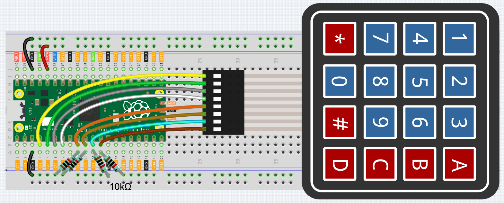

# 4x4 Matrix Keypad Minecraft Controller

Last weekend, I realized I had a 4x4 matrix keypad that I could hook up to my Raspberry Pi Pico. I started thinking, and I realized that I could do a bit of programming, and make it an input device for my computer. I wanted a challenge, so I tried to cram all the Minecraft controls into it. I was able to it! The original code came from [Sunfounder's Euler Kit](https://docs.sunfounder.com/projects/euler-kit/en/latest/pyproject/py_keypad.html), but I ported it to CircuitPython as I prefer it over Micropython. It doesn't necessarily need to be used with Minecraft; you can [modify](#customization) it to suit whatever game/environment you want.

## Features

- **Easy Customization:** You can configure the `characters` array for a quick remapping of keys to suit and game or software you'd like
- **Minimal Hardware:** Requires only a Raspberry Pi Pic, a 4x4 matrix keypad, and 4 10k pull-down resistors

## Getting Started

### Hardware Requirements

- Raspberry Pi Pico
- 4x4 Matrix Keypad
- 4x 10k Resistors
- Jumper Cables

### Hardware Setup

1. **Wiring the keypad:**

    Connect the keypad to the Raspberry Pi Pico as show in the diagram below. Make sure that the 10K resistors are correctly placed as pull-down resistors for the row pins (GP6-GP9).

    

### Software Setup

1. **Install CircuitPython:**

    - Putyour Raspberry Pi Pico into bootloader mode by holding down the `BOOTSEL` button while plugging it into your computer.
    - Download the latest stable CircuitPython UF2 file for the Raspberry Pi Pico from the [Official Circuitpython Website](https://circuitpython.org/).
    - Drag and drop the downloaded UF2 file onto the `RPI-RP2` drive that apppears when the Pico is in bootloader mode. The Pico will automatically reboot with CircuitPython installed.

2. **Upload the Code:**
    - Download `main.py` from this repository
    - Rename `main.py` to `code.py` and copy it to the `CIRCUITPYTHON` drive that appears when the Pico is connected with CircuitPython running

3. **Install Nessecary libraries:**

    - Download the Adafruit CircuitPython Bundle for your CircuitPython version from the [Adafruit GitHub Releases Page](https://github.com/adafruit/Adafruit_CircuitPython_Bundle/releases). Any ZIP file starting with `adafruit-circuitpython-bundle-9.x` works fine.
    - Extract the downloaded ZIP file.
    - Find the `lib` directory within the extracted folder.
    - Copy the `adafruit_hid` folder from the `lib` directory into the `lib` folder on the `CIRCUITPYTHON` drive.

4. Configure it to your needs (Optional)

    You can modify the `characters` array to change the controls. For example, if you wanted to change the top left button to jump, you would change `"LC"` to `"SPACE"`. The controls are as follows:

    - `LC` - Left Click/Attack
    - `RC` - Right Click/Use
    - `IL` - Hotbar Last (Left)/Scroll Wheel
    - `IN` - Hotbar Next (Right)/Scroll Wheel
    - `LL` - Look Left/Move Mouse Left
    - `LR` - Look Right/Move Mouse Right
    - `LU` - Look Up/Move Mouse Up
    - `LD` - Look Down/Move Mouse Down
    - `SH` - Shift/Crouch
    - `ESC` - Escape
    - `SPACE` - Space/Jump
    - `A-Z` - A-Z
    - `0-9` - 0-9/Hotbar

### Using the Keypad

Once the hardware and software are set up, the keypad will function as a [USB HID (Human Interface Device)](https://en.wikipedia.org/wiki/USB_human_interface_device_class), sending keyboard and mouse commands to your computer. The default key mappings are as follows:

| Key | Action                      | Minecraft Equivalent  |
| :-- | :-------------------------- | :-------------------- |
| 1   | Left Click                  | Attack/Break          |
| 2   | W                           | Move Forward          |
| 3   | Right Click                 | Use/Place Block       |
| A   | Shift                       | Sneak                 |
| 4   | A                           | Move Left             |
| 5   | S                           | Move Backward         |
| 6   | D                           | Move Right            |
| B   | Q                           | Drop Item             |
| 7   | Hotbar Left (Previous Slot) | Cycle Hotbar Left     |
| 8   | E                           | Open/Close Inventory  |
| 9   | Hotbar Next (Next Slot)     | Cycle Hotbar Right    |
| C   | Look Up (Mouse Up)          | Look Up               |
| *   | Look Left (Mouse Left)      | Turn Left             |
| 0   | Space                       | Jump                  |
| #   | Look Right (Mouse Right)    | Turn Right            |
| D   | Look Down (Mouse Down)      | Look Down             |


## Customization

The key mappings can be easily customized by modififying the `characters` array in the `code.py` file. Each element in the array corresponse to a key on the keypad, starting from the top left moving row by row.

To change a key's function, replace the existing string with the desired keycode. The following keycodes are supported:

- **Mouse Actions:**
  - `LC`: Left Click
  - `RC`: Right Click
  - `LL`: Mouse Left (move mouse left)/Look Left
  - `LR`: Mouse Right (move mouse right)
  - `LU`: Mouse Up (move mouse up)
  - `LD`: Mouse Down (move mouse down)

- **Keyboard Actions:**
  - `A-Z`:  Letters A to Z
  - `0-9`:  Numbers 0 to 9
  - `SPACE`:  Spacebar
  - `SH`:  Shift Key
  - `ESC`:  Escape Key
  - `IL`: Hotbar Last (Left)/Scroll Wheel equivalent for cycling through hotbar slots
  - `IN`: Hotbar Next (Right)/Scroll Wheel equivalent for cycling through hotbar slots

In the future, I will change some of the mappings so the naming is more friendly with other games/software.

**Example:**

To change the top-left button from Left Click (`LC`) to Jump (`SPACE`), modify the `characters` array as follows:

```py
characters = [
    ["SPACE", "RC", "IL", "IN"],  # Changed "LC" to "SPACE"
    ["A", "S", "D", "Q"],
    ["IL", "E", "IN", "LU"],
    ["LL", "SPACE", "LR", "LD"],
]
```

## Credits

- Original keypad code adapted from [Sunfounder's Euler Kit](https://docs.sunfounder.com/projects/euler-kit/en/latest/pyproject/py_keypad.html).
- CircuitPython and HID library by Adafruit.

## Contributing

Contributions are welcome! Feel free to open issues or pull requests for any improvements or suggestions.

## License

This project is licensed under the MIT License - see the [LICENSE](LICENSE) file for details.
